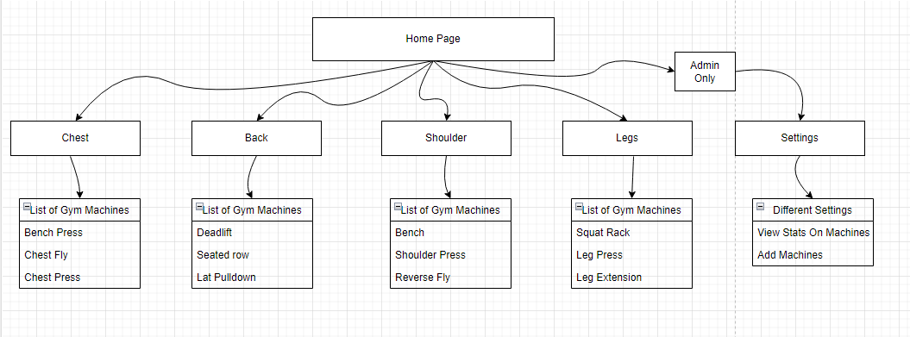

# team-project-big-boys

#### Vision For Front-end
ThefFront-end will be the interface for the user to check the different gym equipment. The goals of our interface are easy to access, understand, and straightforward to use. We want to make the visual design effortless to take a glance at the user interface and be able to tell which machines and benches are available. On the different devices, we will have different stages. These stages will be presented through a “stoplight” color system. Red determines the machine is actively in use, yellow states a member could be between sets, and green indicates the machine is available.
#### Whom is the Front-end for?
The User Interface will be for the gym owners and members to know what machines and benches are available.
#### What problem does it solve?
Wasting time in the gym trying to figure out if certain machines are in use.
#### What alternatives are available, who are your competitors?
There are no alternatives on the market, making no competitors.
#### Front-end Flow
The flow we want for the front-end is to have a home page with information about the product. Then from there, you can choose between different tabs that will be the categories you can choose. The categories are Chest, Leg, Shoulder, and Back. Inside each tab, we will have the list of machines that fit into that categories. Each device will have a light next to it to indicate the machine's stage. Then the final tab is a setting tab that will allow admins to access device information and change the website's settings.
#### Front-end FLow Diagram

